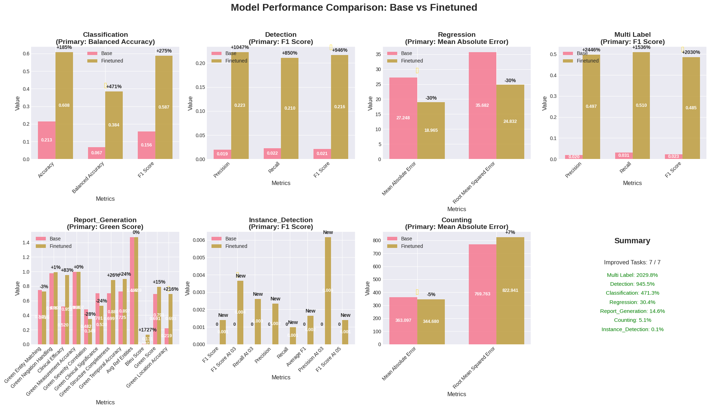

# FLARE 2025 2D MLLM MedGemma Baseline

This repository provides a baseline implementation for the FLARE 2025 2D multimodal medical image challenge using google/medgemma-4b-it

## 🚀 Quick Start with Pre-trained Model

The pre-trained baseline model will be available at:

🤗 **Model**: [MedGemma FLARE2025 Baseline](https://huggingface.co/leoyinn/flare25-medgemma)

## Overview

The pipeline supports all 19 datasets across 8 medical imaging modalities:
- **Retinography**: retino, fundus
- **Ultrasound**: BUSI-det, BUS-UCLM-det, BUSI, BUS-UCLM, iugc
- **X-ray**: boneresorption, dental, periapical, IU_XRay, chestdr
- **Clinical**: neojaundice
- **Microscopy**: chromosome, neurips22cell, bone_marrow
- **Endoscopy**: endo
- **Dermatology**: bcn20000
- **Mammography**: CMMD

### Supported Task Types:
- Classification (Balanced Accuracy)
- Multi-label Classification (F1 Score)
- Detection (F1 Score @ IoU 0.5)
- Instance Detection (F1 Score @ IoU 0.3/0.5)
- Cell Counting (Mean Absolute Error)
- Regression (Mean Absolute Error)
- Report Generation (Comprehensive GREEN Score)

## Requirements

- Python 3.8+
- CUDA 11.8+ with GPU (minimum 16GB VRAM recommended)
- 80GB+ free disk space for datasets and models

## Installation

```bash
# Clone the repository
git clone <repository-url>
cd FLARE25-MedGemma

# Create virtual environment
python -m venv venv
source venv/bin/activate  # On Windows: venv\Scripts\activate

# Install dependencies
pip install -r requirements.txt

# Test installation
python test_installation.py
```

## Quick Start

### Complete Pipeline (Recommended)

The easiest way to run the complete pipeline is using the provided script:

```bash
# Make the script executable
chmod +x run_pipeline.sh

# Run the complete pipeline (prepare data, train, and evaluate)
./run_pipeline.sh

# Run with custom configuration
./run_pipeline.sh --base-dir organized_dataset --num-epochs 5

# Run specific steps only
./run_pipeline.sh --skip-train --skip-eval  # Only prepare data and validate
./run_pipeline.sh --skip-prepare           # Only train and evaluate (requires prepared data)
./run_pipeline.sh --skip-eval              # Only prepare and train
```

The `run_pipeline.sh` script will:
1. Test the installation and validate dependencies
2. Validate the dataset structure and image integrity
3. Prepare the data for training
4. Fine-tune the MedGemma model
5. Evaluate the model performance
6. Generate comprehensive reports

#### Pipeline Options

```bash
# Show all available options
./run_pipeline.sh --help

# Common usage patterns
./run_pipeline.sh --use-subset --max-samples 100    # Quick test with subset
./run_pipeline.sh --skip-validation                 # Skip validation steps
./run_pipeline.sh --num-epochs 5                    # Custom training epochs
```

## Dataset Preparation

The pipeline expects the [FLARE 2025 2D MLLM](https://huggingface.co/datasets/FLARE-MedFM/FLARE-Task5-MLLM-2D) dataset to be organized in the following structure:

```
organized_dataset/
├── training/
│   ├── Retinography/
│   │   ├── retino/
│   │   │   ├── imagesTr/
│   │   │   └── retino_questions_train.json
│   │   └── fundus/
│   │       └── ...
│   └── ...
├── validation-hidden/
│   └── ...
└── validation-public/
    └── ...
```

## Usage (Detailed Control)

For users who want more control over individual steps, you can run each component separately:

### 0. Validate Dataset (Optional but Recommended)

```bash
# Validate dataset structure
python validate_dataset.py --base_dir organized_dataset

# Also check image integrity (slower)
python validate_dataset.py --base_dir organized_dataset --check_images
```

### 1. Prepare Data

```bash
# Process all 19 datasets
python prepare_data.py \
    --base_dir organized_dataset \
    --output_dir processed_data_medgemma

# For testing with subset (3 datasets only)
python prepare_data.py \
    --base_dir organized_dataset \
    --output_dir processed_data_medgemma_subset \
    --use_subset \
    --max_samples 100
```

### 2. Fine-tune Model

```bash
# Full training with MedGemma
python finetune_medgemma.py \
    --model_name_or_path google/medgemma-4b-it \
    --processed_data_dir processed_data_medgemma \
    --output_dir finetuned_medgemma \
    --num_epochs 3

# Resume from checkpoint
python finetune_medgemma.py \
    --resume_from_checkpoint finetuned_medgemma/checkpoint-1000

# Custom training configuration
python finetune_medgemma.py \
    --processed_data_dir processed_data_medgemma \
    --output_dir finetuned_medgemma \
    --num_epochs 5 \
    --lora_rank 16 \
    --gradient_accumulation_steps 4 \
    --early_stopping_patience 3
```

### 3. Evaluate Model

```bash
# Evaluate your fine-tuned model
python evaluate_model.py \
    --processed_data_dir processed_data_medgemma \
    --lora_weights finetuned_medgemma/final \
    --output_dir evaluation_results

# Compare with base model (no fine-tuning)
python evaluate_model.py \
    --processed_data_dir processed_data_medgemma \
    --lora_weights finetuned_medgemma/final \
    --evaluate_base_model \
    --output_dir evaluation_results_comparison

# Evaluate with pre-trained baseline (when available)
python evaluate_model.py \
    --processed_data_dir processed_data_medgemma \
    --lora_weights [HUGGINGFACE_MODEL_ID] \
    --output_dir evaluation_results_baseline
```

### 4. Inference

#### FLARE 2025 Challenge Inference

For challenge submission, use the automatic dataset discovery:

```bash
# Using fine-tuned model
python inference.py \
    --dataset_path path/to/dataset \
    --lora_weights finetuned_medgemma/final \
    --output_file predictions.json

# Using base model only
python inference.py \
    --dataset_path path/to/dataset \
    --model_name google/medgemma-4b-it \
    --output_file predictions.json
```

This automatically finds all `*_questions_val.json` files in `dataset_path` and outputs `predictions.json`.

#### Command Line Options

```bash
python inference.py [-h] --dataset_path DATASET_PATH [--model_name MODEL_NAME] [--lora_weights LORA_WEIGHTS]
                    [--device {cuda,cpu,auto}] [--no_quantize] [--output_file OUTPUT_FILE] [--batch_size BATCH_SIZE]
                    [--max_tokens MAX_TOKENS] [--verbose]
```

**Required:**
- `--dataset_path`: Path to organized_dataset folder

**Model Options:**
- `--model_name`: Base model name (default: google/medgemma-4b-it)
- `--lora_weights`: Path to LoRA weights/adapter
- `--device`: Device to use (cuda/cpu/auto)
- `--no_quantize`: Disable 4-bit quantization

**Generation Options:**
- `--output_file`: Output predictions file (default: predictions.json)
- `--max_tokens`: Maximum tokens to generate (default: 256)
- `--temperature`: Sampling temperature (default: 0.1)
- `--verbose`: Enable verbose output

#### Output Format

The script outputs a single `predictions.json` file with the same structure as input questions but with filled `Answer` fields:

```json
[
    {
        "TaskType": "classification",
        "Modality": "microscopy",
        "ImageName": "imagesVal/bone_marrow_00056.jpg",
        "Question": "Question: What diagnosis best fits the cellular pattern in this bone marrow? Options: A: Normal bone marrow B: Myelofibrosis...",
        "Answer": "D",
        "Split": "val"
    }
]
```

## Docker Deployment

### Quick Start with Docker

```bash
# Build Docker image
cd docker_deployment
./docker_build.sh

# Run inference
docker run --gpus all \
    -v $(pwd)/path/to/dataset:/app/input/organized_dataset \
    -v $(pwd)/predictions:/app/output \
    --rm medgemma-inference:latest
```

For detailed Docker instructions, see [docker_deployment/README.md](docker_deployment/README.md).

## Pre-trained Baseline Model

### Model Details
- **Base Model**: google/medgemma-4b-it
- **Fine-tuning**: QLoRA (4-bit quantization)
- **Training Data**: All 19 FLARE 2025 datasets
- **Parameters**: ~4B base + LoRA adapters

## Key Features

### Memory Optimization
- 4-bit quantization with QLoRA
- Dynamic batch sizing based on available GPU memory
- Fast image loading with OpenCV and caching
- Gradient checkpointing for memory efficiency

### Training Strategy
- Only trains on assistant responses (proper instruction masking)
- Task-specific prompt engineering for medical domains
- Early stopping with patience
- Cosine learning rate schedule with warmup
- Multi-image support for complex medical cases

### Evaluation Metrics
- Comprehensive metrics per task type
- Multiple IoU thresholds for detection tasks (0.3-0.7)
- Per-chromosome breakdown for instance detection
- Detailed comparison reports
- GREEN Score for report generation with:
  - Clinical entity matching with severity assessment
  - Anatomical location grounding with laterality
  - Temporal information consistency
  - Size/measurement accuracy
  - Uncertainty and negation handling
  - Clinical significance weighting
  - Report structure evaluation

## Configuration Options

### prepare_data.py
- `--max_samples`: Limit samples per dataset for prototyping
- `--use_subset`: Use only 3 datasets for testing
- `--base_dir`: Path to organized dataset folder
- `--output_dir`: Output directory for processed data

### finetune_medgemma.py
- `--batch_size`: Per-device batch size (auto-determined by default)
- `--gradient_accumulation_steps`: Steps to accumulate gradients
- `--num_epochs`: Number of training epochs (default: 3)
- `--lora_rank`: LoRA rank (default: 16)
- `--early_stopping_patience`: Early stopping patience (default: 5)
- `--model_name_or_path`: Base model name or path
- `--max_seq_length`: Maximum sequence length (default: 2048)

### evaluate_model.py
- `--max_eval_samples`: Limit evaluation samples per task
- `--save_predictions`: Save individual predictions
- `--lora_weights`: Path to LoRA weights (local path or HuggingFace model ID)
- `--evaluate_base_model`: Compare with base model (default: True)
- `--output_dir`: Directory to save evaluation results

## Performance Notes

### System Requirements
- **Training**: ~16GB GPU memory with default settings
- **Inference**: ~8GB GPU memory (with fine-tuned model)
- **Training Time**: 18-36 hours on A100 for full dataset
- **Evaluation Time**: 2-4 hours depending on dataset size

### Baseline Performance Results

The MedGemma model shows significant improvements over the base google/medgemma-4b-it model across all FLARE 2025 tasks:




#### Primary Metrics Improvements (Base → Fine-tuned):

| Task Type                      | Primary Metric      | Base Model | Fine-tuned | Improvement |
| ------------------------------ | ------------------- | ---------- | ---------- | ----------- |
| **Classification**             | Balanced Accuracy   | 0.0671     | 0.3836     | ↑ 471.3%    |
| **Detection**                  | F1 Score            | 0.0207     | 0.2163     | ↑ 945.5%    |
| **Multi-label Classification** | F1 Score            | 0.0228     | 0.4848     | ↑ 2029.8%   |
| **Report Generation**          | GREEN Score         | 0.6908     | 0.7914     | ↑ 14.6%     |
| **Instance Detection**         | F1 Score            | 0.0000     | 0.0014     | ↑ 0.1%      |
| **Regression**                 | Mean Absolute Error | 27.2476    | 18.9651    | ↓ 30.4%     |
| **Counting**                   | Mean Absolute Error | 363.0968   | 344.6800   | ↓ 5.1%      |

> **Key Results**: The MedGemma model shows significant improvements across all task types, with particularly strong performance in multi-label classification (2029.8% improvement) and detection tasks (945.5% improvement). The model achieved 100% task improvement rate across all 7 evaluation categories.

### Benchmarking
Use the fine-tuned model as a baseline to:
- Compare your fine-tuned models against these results
- Quick start for FLARE 2025 submissions
- Understand expected performance ranges across medical imaging tasks
- Validate your data preparation and training pipeline

## Citation

If you use this baseline in your research, please cite:

```bibtex
@misc{medgemma-flare2025,
  title={MedGemma Fine-tuned for FLARE 2025 Medical Image Analysis},
  author={[Your Name]},
  year={2025},
  publisher={Hugging Face},
  url={[URL when available]}
}

@misc{medgemma-base,
  title={MedGemma: Medical Gemma Models for Healthcare Applications},
  author={Google Research},
  year={2024},
  publisher={Google},
  url={https://huggingface.co/google/medgemma-4b-it}
}

@misc{flare2025,
  title={FLARE 2025: Foundation Model Learning and Adaptation for Medical Foundation Models},
  author={FLARE Challenge Organizers},
  year={2025},
  url={https://flare-medfm.github.io/}
}
```

## License

This project is licensed under the Apache-2.0 License - see the LICENSE file for details.

## Dataset Access

The FLARE 2025 datasets can be accessed at:
- **Main Dataset**: [FLARE-MedFM/FLARE-Task5-MLLM-2D](https://huggingface.co/datasets/FLARE-MedFM/FLARE-Task5-MLLM-2D)
- **Challenge Info**: [FLARE 2025 Official Website](https://flare-medfm.github.io/)

## Acknowledgments

- Google Gemma team for the base model
- FLARE 2025 organizers for the dataset and challenge
- HuggingFace for the transformers library and model hosting
- Medical imaging communities for the public datasets
- PyTorch and associated libraries for deep learning infrastructure

## Contributing

Contributions are welcome! Please:

1. Fork the repository
2. Create a feature branch
3. Make your changes
4. Add tests if applicable
5. Submit a pull request

## Support

For questions and issues:

1. Check the troubleshooting section above
2. Run `python test_installation.py` to diagnose problems
3. Search existing GitHub issues
4. Create a new issue with detailed information

---

**Note**: This is a research baseline implementation. For production medical applications, ensure proper validation, regulatory compliance, and clinical oversight. 
